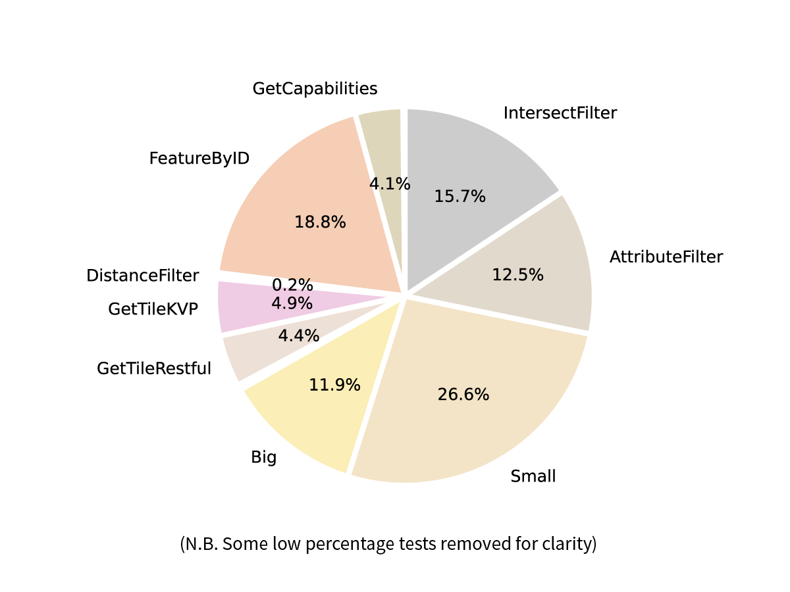
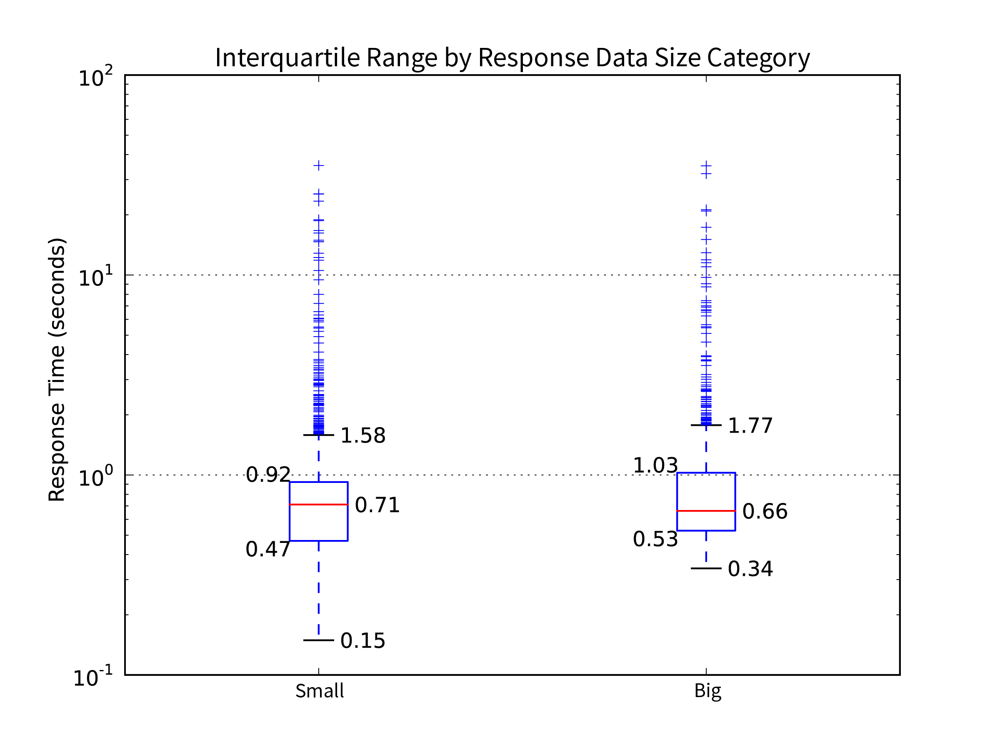
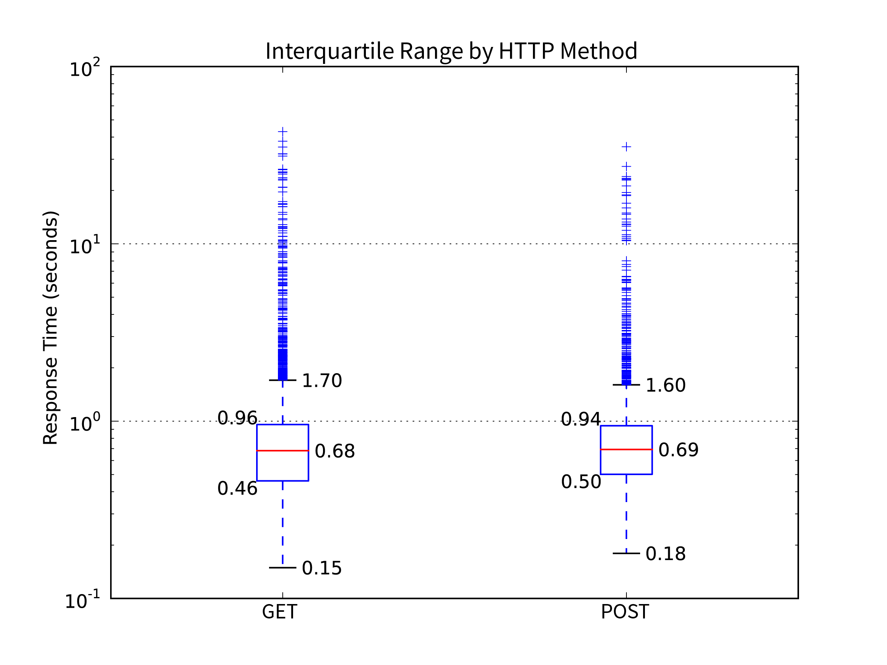

## Results

### Test Regime

The "production_campaign" featured two main pushes of testing. The first in December 2015 through to January 2016 tested Google Maps Engine endpoints before their shutdown. The campaign's main thrust took place in March 2016 where the majority of tests queried the old OGC endpoints and the new Esri endpoints.

The user initiated 284 TestMasters resulting in 16,144 TestEndpoints, as shown in the table below. The count of LocationResults, NetworkResults and PingResults are each over 200 higher than the TestEndpoint count as they are run before the first EndpointTest and after the last one. The small differences account for a few dozen TestMasters cancelled or aborted before finalising the tests at the end.

| Test                   | Count |
| ---------------------- | ----: |
| Count Test Masters     |   284 |
| Count Test Endpoints   | 16144 |
| Count Location Results | 16391 |
| Count Network Results  | 16391 |
| Count Ping Results     | 16345 |

Tests were undertaken in a broad range of situations common to mobile device use. Situations of varying mobile network signal strength were deliberately sought. Such situations were found while travelling on highways between cities or, Interestingly while crossing the Sydney Harbour Bridge. There were fewer tests conducted while connected to WiFi as the results tend to not be useful except as an upper bound to connection speed.

Device motion ranged from stationary (such as in an office environment) to highway speeds. Note that the chosen level of GPS location accuracy also affected calculation of device speed, particularly where tests complete quickly over a good mobile network but location results less reliable (a common situation in the city).

There were three theatres of action in the campaign. Each test is mapped in a Leaflet web map using the location of its Vector's PreTestLocation (the LocationTest completed before the TestEndpoint began). Visualising 16,000 points would result in an ineffective map, so here closely clustered points are generalised into a heat map. A beneficial side effect of generalisation is to obfuscate precise locations.

The majority of tests took place in Sydney, NSW and its environs. In particular the regular commute over the harbour to the Central Business District, and the roads and freeways to neighbouring cities.

Several discrete bursts of tests took place in Bathurst, NSW and the highway back and forth to Sydney, NSW. The figure below shows several clusters of tests in the main streets of Bathurst.

Townsville, QLD was the theatre with the least number of tests, but some interesting mobile situations involving ferry crossings and steep terrain on Magnetic Island.

### Test Device Hardware

All tests were performed on an Apple iPhone 6S, model A1688 (a.k.a. iPhone8,1), with 64GB of storage. The standard device comes with a range of mobile radios across many bands; LTE, HSDPA, CDMA, GSM, EDGE, Wi-Fi radios a/b/g/n/ac and GPS and GLONASS receivers {Anonymous:uf}.

|                  |                             |
| ---------------- | --------------------------- |
| Campaign Name    | production_campaign         |
| All Device Types | iPhone8,1                   |
| All iOS Versions | 9.1, 9.2, 9.2.1, 9.3, 9.3.1 |

The operating system changed through the campaign as Apple Inc. updated their software. The first tests launched LandgateAPITest on iOS 9.1, later tests on 9.2, 9.2.1 and later still on 9.3 and 9.3.1.

### TestEndpoint Successes and Failures

Of the 16,144 TestEndpoints 15,670 were successful on device (97.06%). These were able to complete the test and received a 200 response code from the Landgate server. The 2.94% of on device failures either could not reach the server (response code 0) or received a server error response (code 500 and above).

LandgateAPITest's `Analyse` function compared each TestEndpoint's response data to the stored reference data and determined that 13,220 of them match, setting the resultant Vector's referenceCheckSuccess flag to True.

Closer examination of referenceCheckSuccess by test type (detailed in the following table) showed 9 test types that consistently failed their reference checks (less than 5% passed). All such Vectors had their ReferenceCheckValid flag set to False to exclude them en masse from further analysis on the assumption that there was a systematic issue with their reference data.

Notably, the GetCapabilities tests rarely passed reference checks. Likely causes include changes to services offered during the test campaign or possibly conflicting timestamps buried in the XML response and reference.

| Test Name                                | Percent Reference Check Successful |
| ---------------------------------------- | ---------------------------------: |
| ESRI - BusStops - AttributeFilter - GET - JSON |                             98.79% |
| ESRI - BusStops - AttributeFilter - POST - JSON |                             98.20% |
| ESRI - BusStops - FeatureByID - GET - JSON |                             99.00% |
| ESRI - BusStops - FeatureByID - POST - JSON |                             98.76% |
| ESRI - BusStops - GetCapabilities - GET - JSON |                             97.64% |
| ESRI - BusStops - GetCapabilities - POST - JSON |                             98.99% |
| ESRI - BusStops - IntersectFilter - GET - JSON |                             97.31% |
| ESRI - BusStops - IntersectFilter - POST - JSON |                             98.21% |
| ESRI - BusStops - Small - GET - JSON     |                             96.98% |
| ESRI - BusStops - Small - POST - JSON    |                             97.89% |
| ESRI - Topo - Big - POST - Image         |                             99.45% |
| ESRI - Topo - Small - GET - Image        |                             99.32% |
| ESRI - Topo - Small - POST - Image       |                               100% |
| GME - AerialPhoto - Big - GET - Image    |                             96.97% |
| GME - AerialPhoto - GetTileKVP - GET - Image |                             95.65% |
| GME - AerialPhoto - GetTileKVP2 - GET - Image |                             93.75% |
| GME - AerialPhoto - GetTileKVP3 - GET - Image |                             90.63% |
| GME - AerialPhoto - GetTileKVP4 - GET - Image |                             90.91% |
| GME - AerialPhoto - Small - GET - Image  |                             86.36% |
| GME - AerialPhoto - WMSGetCapabilities - GET - XML |                                 0% |
| GME - AerialPhoto - WMTSGetCapabilities - GET - XML |                                 0% |
| GME - BusStops - AttributeFilter - GET - JSON |                             83.87% |
| GME - BusStops - Big - GET - JSON        |                                 0% |
| GME - BusStops - DistanceFilter - GET - JSON |                             93.75% |
| GME - BusStops - FeatureByID - GET - JSON |                             96.55% |
| GME - BusStops - IntersectFilter - GET - JSON |                             90.63% |
| GME - BusStops - Small - GET - JSON      |                                 0% |
| OGC - AerialPhoto - GetTileKVP - GET - Image |                             98.85% |
| OGC - AerialPhoto - GetTileRestful - GET - Image |                             98.36% |
| OGC - BusStops - AttributeFilter - GET - JSON |                              0.83% |
| OGC - BusStops - AttributeFilter - GET - XML |                             99.72% |
| OGC - BusStops - AttributeFilter - POST - JSON |                             98.63% |
| OGC - BusStops - AttributeFilter - POST - XML |                             99.45% |
| OGC - BusStops - Big - GET - JSON        |                               100% |
| OGC - BusStops - Big - GET - XML         |                               100% |
| OGC - BusStops - Big - POST - JSON       |                               100% |
| OGC - BusStops - Big - POST - XML        |                               100% |
| OGC - BusStops - FeatureByID - GET - JSON |                             99.30% |
| OGC - BusStops - FeatureByID - GET - XML |                             98.85% |
| OGC - BusStops - FeatureByID - POST - JSON |                               100% |
| OGC - BusStops - FeatureByID - POST - XML |                             99.54% |
| OGC - BusStops - GetCapabilities - GET - XML |                              2.88% |
| OGC - BusStops - GetCapabilities - POST - XML |                              1.26% |
| OGC - BusStops - IntersectFilter - GET - JSON |                             99.73% |
| OGC - BusStops - IntersectFilter - GET - XML |                             99.46% |
| OGC - BusStops - IntersectFilter - POST - JSON |                             99.46% |
| OGC - BusStops - IntersectFilter - POST - XML |                               100% |
| OGC - BusStops - Small - GET - JSON      |                             98.81% |
| OGC - BusStops - Small - GET - XML       |                               100% |
| OGC - BusStops - Small - POST - JSON     |                             99.76% |
| OGC - BusStops - Small - POST - XML      |                             98.83% |
| OGC - Topo - Big - GET - Image           |                              3.63% |
| OGC - Topo - Small - GET - Image         |                              3.48% |

See Appendices A and B for a list of URLs for each request.

Of the remaining tests only 79 (0.6%) failed a reference check. And 2.9% of the referenceCheckValid tests failed on the device itself.

### Test Results by Response Time

The LandgateAPITest web application produces charts of current data on request to the `Graph` endpoint. All charts in this text are saved versions of these as they stood on the 7th of May, 2016. Links are provided in the text to the endpoint for each chart displayed so that the reader may receive the latest information.

The various requests are subcategorised by their test name, a general description denoting near identical requests across the three server types. A FeatureByID request returns the same data from all three servers, though it may not be in the same format (GML, Esri JSON, GeoJSON for example). [This pie chart](https://landgateapitest.appspot.com/graphs?campaignName=production_campaign&graphName=graph3) was modified to exclude some of the smallest percentage test types to aid reading clarity.

The most elucidating test types in figure 4.6 are explained in the following paragraphs.

Aligned with Fowler, Hameseder and Peterson's {\*Fowler:2012bn} experimental control showing that response data size affects response time, LandgateAPITest requests "Small" and "Big" responses. Small requests are either for a few features in GML or JSON or an image only a few tens of pixels in dimension. Big requests ask for 100 vector features or images 500 pixels in dimension.

The distribution of their response times are shown in a box and whiskers chart, available at this [link](https://landgateapitest.appspot.com/graphs?campaignName=production_campaign&graphName=graph25). Box and whiskers charts show the interquartile range of a distribution. The dataset is divided into four equal parts around the median value, shown as a red line. The first quartile (Q1) to the third quartile (Q3) are contained within the blue box and contain 50% of the points in the dataset. The "whiskers" above and below the box show the range of the data and in a normal distribution would contain over 99% of the data points. Skewed distributions end up excluding the outliers from the interquartile range, shown here as blue crosses.

The "Big" requests have a similar Q1 to Q3 (interquartile range) to "Small" ones. The lowest values in the whiskers are significantly slower to arrive. Both have a significant number of outliers above the maximum response time whisker.

Spatial servers can filter results either by a function of the attributes of each feature, returning features from any location meeting certain criteria of their properties. Features may instead be filtered by a spatial function, returning features from a specific location of any attribute value. The response time frequency distributions for four test types which call upon the server to filter results are shown in the [box and whiskers chart](https://landgateapitest.appspot.com/graphs?campaignName=production_campaign&graphName=graph26).

* Feature by ID calls for a single feature with an exactly matching ID
* Attribute Filter test requests features with a text "location" property containing the word "Curtin"
* Spatial intersect requests provide an envelope (minX, min Y, max X and max Y) covering the Curtin University Bentley campus and request only features intersecting the envelope
* Distance Filter was only requested from GME servers, returning only the closest feature to a point within Curtin University's Bentley campus, the operation involved sorting the entire table by distance and selecting the closest

The two attribute filters generally show a distribution of response times shorter than the two spatial filters. This should be expected of indexed data subjected to an equality operation. The confidence in this result is not great. Firstly, all have a significant number of high outliers denoting skewed distributions. The spatial filter medians are only 2 to 3 tenths of a second slower than the two attribute filters. The much smaller Distance Filter sample size makes it less worthy of consideration.

JSON response data dominated the requests, being the only format available across all three server types. XML's geographic subset, GML, is only routinely served by OGC endpoints. Images were not requested as often, there being fewer server-side filtering functions available. Users may request the latest pie chart from the LandgateAPITest web app at this [link](https://landgateapitest.appspot.com/graphs?campaignName=production_campaign&graphName=graph4).

The [box and whisker chart](https://landgateapitest.appspot.com/graphs?campaignName=production_campaign&graphName=graph24) shows the response time distribution for XML responses is tighter and higher overall than the similar JSON and image request response time distributions. All three have a significant number of outliers in their upper ranges, showing clearly skewed distributions with most requests achieved in short time frames.

The Esri and OGC portion of the test campaign in March 2016 was more vigorous than the earlier GME part in December 2015. [This pie chart](https://landgateapitest.appspot.com/graphs?campaignName=production_campaign&graphName=graph1) shows how clearly the Esri and OGC tests overwhelm the fewer GME ones.

The [box and whiskers chart](https://landgateapitest.appspot.com/graphs?campaignName=production_campaign&graphName=graph22) appears to show a clear performance win for the Esri servers over the OGC servers, having a much lower median and interquartile range. There is a significant consideration here that Esri servers do not supply heavier payload XML/GML responses where OGC ones do. As the response data type and response size charts show, on average larger responses have slower response times.

The GME tests fill a broader interquartile range and have fewer outliers. A larger sample set of these requests may have increased confidence in this result.

[This pie chart](https://landgateapitest.appspot.com/graphs?campaignName=production_campaign&graphName=graph2) shows tests were almost evenly split between the two HTTP methods favoured by spatial servers; GET and POST. The greater proportion of GET requests are partly due to the lack of POST requests created for the GME server and the map tile requests mostly being GET's with key value coding or straight RESTful endpoints.

There was no distinct difference in response time between the two methods. The medians and boundaries of interquartile ranges are similar enough that differences may be rounding errors. The latest graph is available [here](https://landgateapitest.appspot.com/graphs?campaignName=production_campaign&graphName=graph23).

An important disparity to note, Esri POST requests required Form-URL-encoded bodies (i.e. content type = application/x-www-form-urlencoded), whereas OGC POST requests were all XML in plain text (content type = text/xml).

### Test Results by Distance Device Travelled

The test device deployed determined its location through GPS. The Vector object considers the distance between the LocationTest prior to an EndpointTest and the LocationTest afterwards. By comparing each Vector's distance property to its response time, a scatter plot is produced. Then the web application categorises the points by the EndpointTest's success, on device failure or reference check failure. The live graph is available [here](https://landgateapitest.appspot.com/graphs?campaignName=production_campaign&graphName=graph12).

The green successful tests show a loose trend of increasing response time in line with increasing distance travelled.

The orange "failed on device" category exhibit three distinct horizontal bands of response times. The bottommost band are the shortest response times, notably so as they are at most 1/100th of a second. These are the cases where the device had no mobile network connection at all and the operating system aborted the request immediately without even an attempt to send it to the server.

The middle band of "on device failures" are those with similar response times to many successful requests. These are the tests cancelled before completion. They had a successful link to the server but the test was interrupted by an incoming phone call or the app was otherwise switched to the background. In line with the application's design goals these tests were aborted, their response time recorded and marked as on device failures.

The uppermost band forms a clear line around 30 seconds in response time. This is the standard time-out length for a web service request on an iOS device. Requests without a response are aborted by the system. Interestingly, the majority of these failures occurred when the device travelled more than 100m. In such cases, the device is more likely to change mobile network cell tower or enter areas of weaker signal, preventing completion of the exchange.

Tests with failed reference checks returned data inconsistent with the reference files in the web application's archive. Similarly, the majority occurred when the device travelled more than approximately 50m in the test period. This indicates changing mobile network environment interrupts reception of response data.

The scatterplot shows enough noise to produce R-squared values that are less than ideal. Each value of distance produces a range of response times due to several factors, most notably the response payload size varies by request type. Distance values are not perfect either as consideration must be given to the GPS receiver's desired and possible accuracy.
