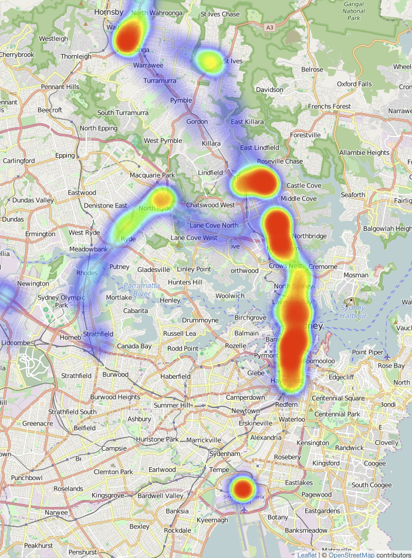
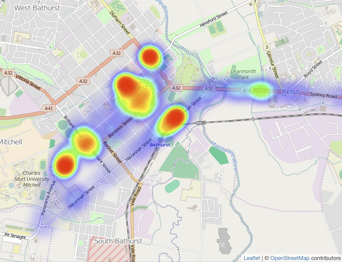
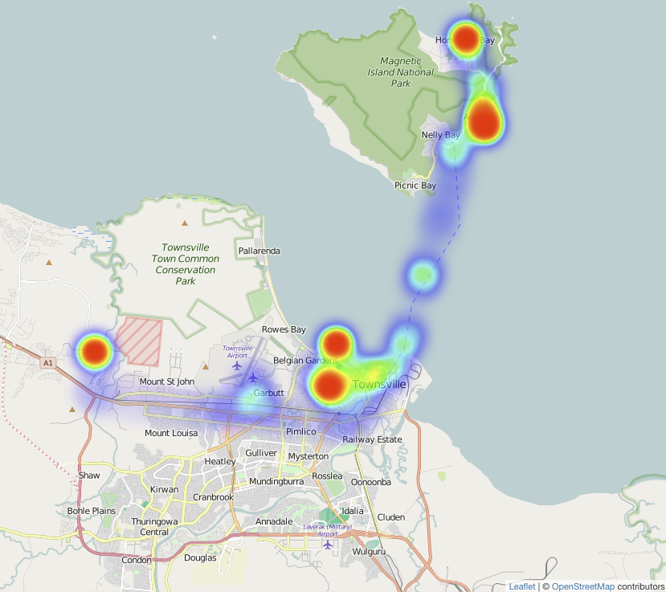
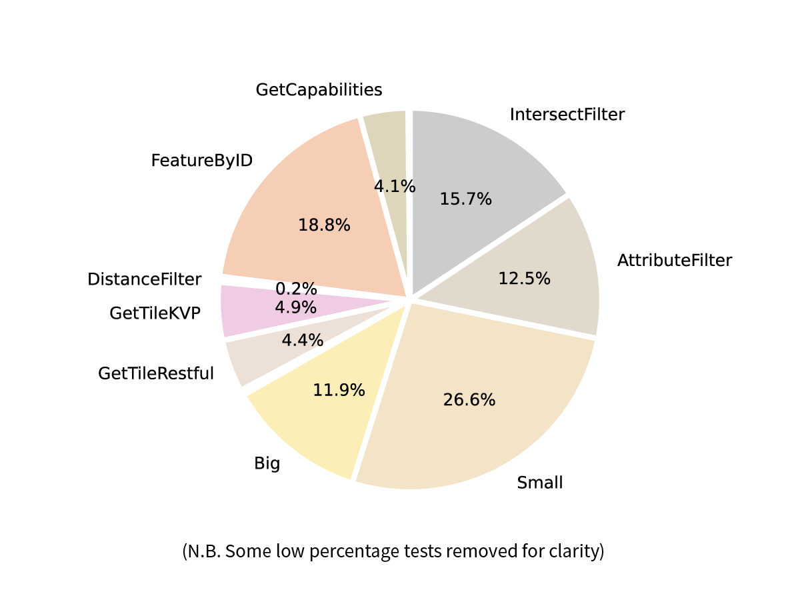
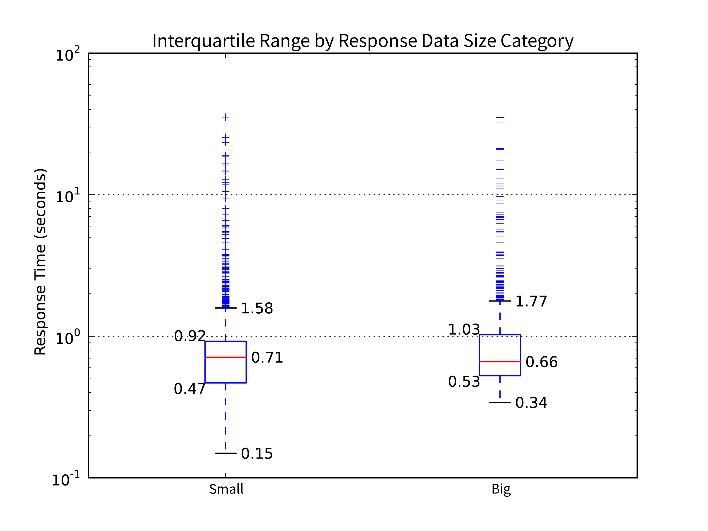
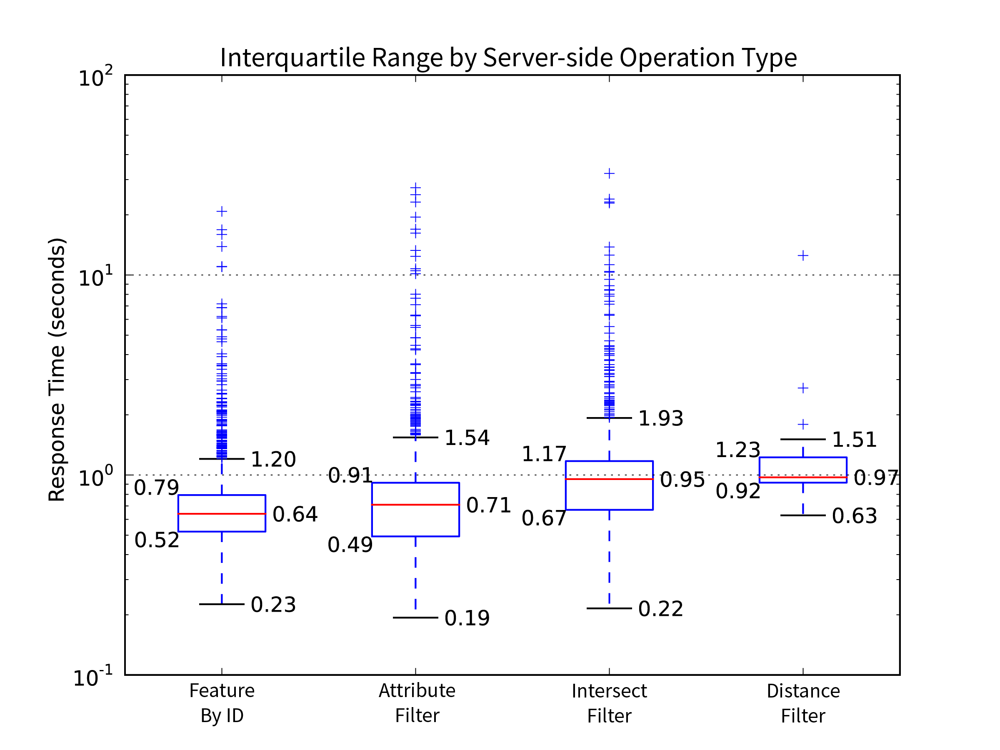
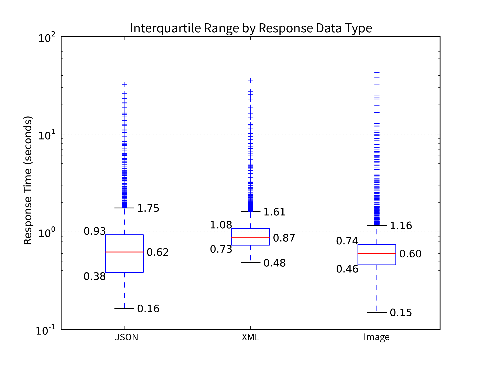
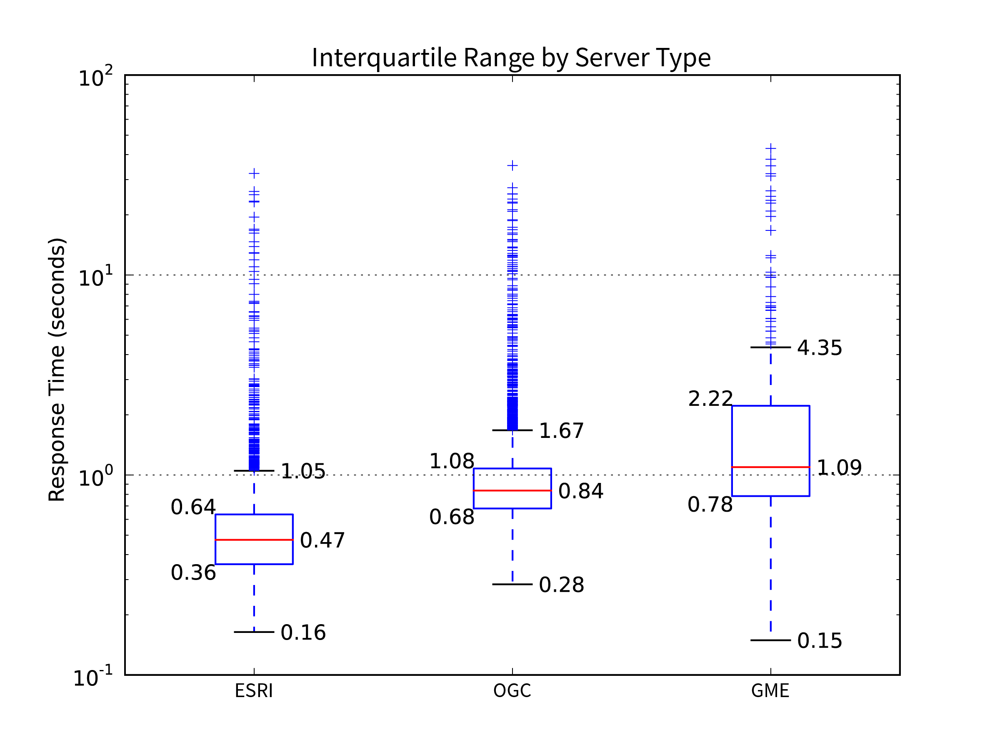
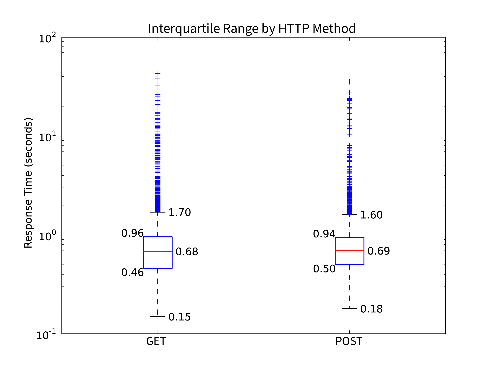
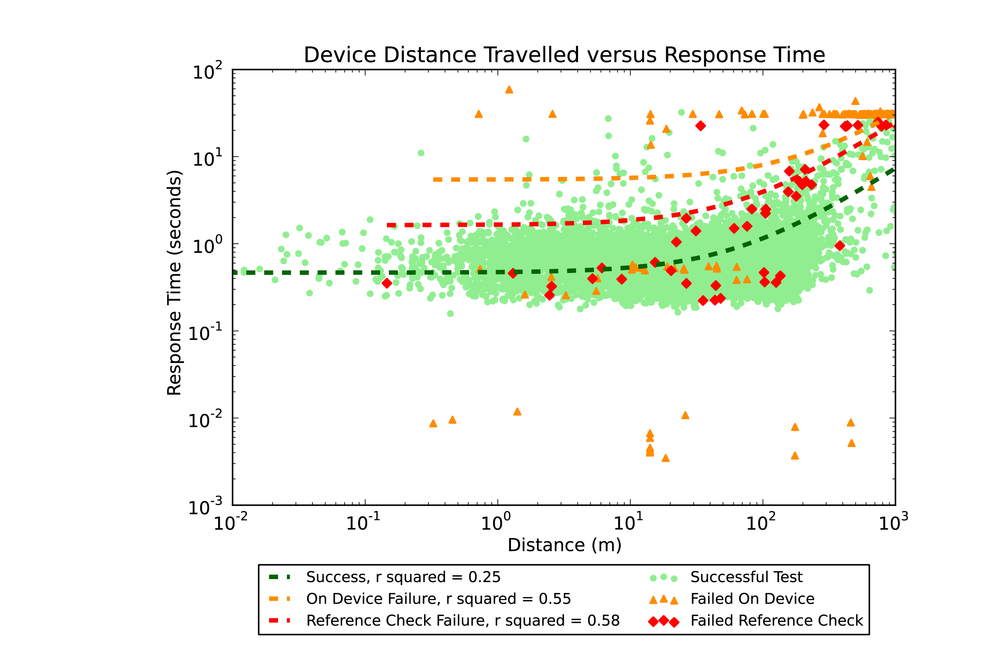

---
title:  'Landgate API Test - Testing SLIP’s Spatial Web Services from a Mobile Device'
author:
- name: Aiden Price
  affiliation: Curtin University
tags: [spatial web services, OGC, WMS, WMTS, WFS, mobile, testing, Google Maps Engine, Esri ReST]
abstract: |
    Landgate is Western Australia's premier spatial data provider. The Shared Location Information Platform (SLIP) is the WA Government's spatial data portal.

    Research on spatial web service testing aims to test under controlled conditions, to eliminate variables of network connectivity or device speed. Controls tend to poorly reflect real world mobile device usage. This research eschews controls, preferring to gather data on the test environment at test time.

    Further, research tends to focus on response time as the main metric of service performance, an objective measure. Few papers consider whether the data returned are correct. Mobile downloads can be interrupted by lost signal, resulting in an incomplete response. Unreliable responses decreases a user's desire to reuse and recommend a mapping application.

    LandgateAPITest is a suite composed of a mobile application for testing and a Google App Engine web application for storage and analysis. The suite combines response time measurements with inconsistent responses to paint a picture of Landgate's servers' suitability for mobile devices.

    Deploying LandgateAPITest against SLIP's spatial web services confirms earlier studies’ findings and demonstrates that the mobile network is the biggest factor in performance and response quality.

    The end result is a set of mobile suitability metrics. The frequency distribution of response time across a number of web service request types demonstrates performance. The percentage of requests with inconsistent response data measures quality.

    Providing these metrics to the SLIP team will aid Landgate in objectively measuring progress towards their goal of enabling access to location information.
...

## Introduction

Landgate is Western Australia's cadastre authority and foremost spatial data agency. It is the leading organisation in the Western Australian Land Information System (WALIS) and its open data portal; the Shared Location Information Platform (SLIP). As SLIP was built on Google Maps Engine (GME), Google Inc.'s closure of the service forced Landgate and WALIS into a period of rapid change. Esri ArcGIS for Server infrastructure replaced GME as Landgate's production spatial servers.

In this work, a testing suite was built consisting of a mobile application for testing and a web service for analysis, named LandgateAPITest. The suite was applied to Landgate's spatial server infrastructure before and after the pivot away from GME.

The use of a mobile device as a test platform and its deployment in real world conditions is a departure from much of the academic research on spatial web service testing. LandgateAPITest eschews experimental controls as found in related works, such as mobile devices simulated on desktop computer hardware. Further, most research reports results as a few descriptive statistics of web service request response time. LandgateAPITest aims to inspect response data for returns inconsistent with reference data sets.

The testing suite provides a measurement set as its outputs, frequency distributions of response time and a percentage of responses with inconsistent data, termed mobile suitability metrics. These are aligned with a technology acceptance model related in other works such that improvement in these scores should occasion greater user acceptance of SLIP's spatial web services. This work, looks to uncover practical and actionable recommendations which can aid Landgate in improving their service to the community.

## Background

### Web Services

Web services enable interaction between computer systems over a network {Anonymous:bRhwymPh}. One system may call on another to provide data or a service without requiring a human user to mediate the interaction. Mobile devices have limited processing power and storage available, so off-device storage and processing empowers on-device applications.

Service Oriented Architectures (SOA) is a principle of software design that aims to compose a software product from loosely coupled, and hence replaceable, components {Endo:2010wf}. Designers commonly employ this pattern as a method for distributed computing {Palacios:2011eo}. 

Representational State Transfer (REST) services are easy to develop and consume {Castillo:2011ve}. The adoption of RESTful services has led to an explosion of data available on the web, particularly with mobile applications in mind as end consumers.

REST services use HTTP/HTTPS as their transport layer {Castillo:2011ve}. This permits them to employ the standard HTTP response codes to indicate the success of a request. Briefly, such codes include the 200 series for success, 300 codes for resources moved elsewhere, 400 series for bad requests from the client and the 500 series for server errors. 

### Spatial Web Services

#### Open Geospatial Consortium Web Map Service and Web Feature Service

The Open Geospatial Consortium (OGC) is an international group of industry, government, academic, and community representatives whose aim is to improve business processes through the integration of location data {Reed:2011kt}. 

A Web Map Service (WMS) composes an image file from from server stored vector and raster layers in response to a request in a URL. A Web Feature Service (WFS) returns geographic vector data in GML (Geographic Markup Language, a derivative of XML). It is a more complex and capable service than WMS. If fully deployed, WFS grants external users full create, read, update, and delete (CRUD) access to a geographic database {Vretanos:2005ut}.

#### Google Maps Engine

Google Inc.'s Google Maps Engine (GME) service enabled the creation of more sophisticated web mapping services on top of the Google Maps interface. Whereas the familiar Google Maps application only allowed one or two additional map layers to be displayed, Google Maps Engine could host many hundreds of datasets in the cloud and perform multi-layer geographic analysis {Anonymous:s3eShq99}.

In a commercial decision, Google Inc. announced the deprecation of the GME API on the 29th of January 2015 {Anonymous:2015tg}. Google shut the service on the 29th of January 2016.

#### Esri ArcGIS for Server and ArcGIS REST API

ArcGIS for Server is Esri's enterprise level product for intra/Internet GIS and provisioning web services {Anonymous:BHtz-GD9}.

The ArcGIS REST API exposes ArcGIS for Server data and functions as web services. This modern API has been fully developed since 2010 {Anonymous:hoTu0aor}. ArcGIS for Server's age means it is also capable of supporting older web service standards such as SOAP.

### Landgate

Landgate is the statutory authority given charge of maintaining the state's land and property information system {Anonymous:2004tv}. The organisation is the inheritor of the mandate of various incarnations of the Department of Lands and Surveys, dating back to the original Survey Office in the 19th Century.

Landgate's role incorporates managing property ownership and transfer records, as well as property valuations to government agencies {Anonymous:x1iQOCOB}.

Figure 1.1 - Organisation of Landgate and WALIS, adapted from Location Information Strategy Program Coordination Team, 2012

The Western Australian Land Information System (WALIS) is a partnership between government agencies, the private sector, academia, and the community. Their aim is to improve access to location information for the betterment of the Western Australian community {LocationInformationStrategyProgramCoordinationTeam:2012te}.

The Shared Location Information Platform (SLIP) is WALIS's spatial data portal, the Western Australian government's Spatial Data Infrastructure (SDI), managed by Landgate. The portal presents datasets owned and maintained by authoritative agencies, standardises data formats and simplifies access.

SLIP Future is WALIS's programme to revamp the original SLIP Enabler portal and infrastructure {Anonymous:2014ww}. The older infrastructure was deemed incapable of handling projected usage. WALIS built a new platform around Google's Software as a Service (SaaS) Google Maps Engine (GME). The new environment offered significant advantages in reliability, scalability, and feature set {Anonymous:2014ww}.

In January 2015, Google announced the deprecation of Google Maps Engine {SLIPFuture:2015uc}. Further, they planned to shut the service entirely by the end of January 2016 {Anonymous:2015tg}. Landgate and WALIS were left in search of a new provider for the SLIP Future programme. Esri aggressively sought the business of GME refugee organisations {Anonymous:7YAzB1Ym} offering free software replacements and membership to business partnership programs. In July 2015, Landgate selected Esri's ArcGIS Server and Portal as the replacement for GME {Anonymous:2015uc}. Web services offering datasets in Esri's ArcGIS REST APIs replaced GME's API through a transition period through the end of 2015 and beginning of 2016.

Landgate's mandate to provide spatial data services through SLIP has been somewhat derailed by the deprecation of Google Maps Engine. The work presented within looks at developing a testing suite to aid Landgate and WALIS in measuring their success against SLIP's goals. Related work, explored below, is taken as a guide to design and implementation, detailed in the Materials and Methods section.

## Literature Review

### Related Work

Web services are widely studied {Tahir:2013jd, Qiu:2015eq, ElIoiniNabil:2015us}. However, the scope of applications for web services is broad. There are, therefore, few studies that examine the intersection of geographic web service performance, mobile device context and a single, state-level spatial data infrastructure. Following are a cross-section of papers with aims partially aligned to those of this work.

Hamas, Saad, and Abed {\*Hamad:2010tr} compared the performance of SOAP and REST APIs on mobile devices. The measured criteria were response time and transmission size which predictably favoured REST interfaces.

Their experiment design emulated a mobile device on a desktop computer; further, they restricted the simulated mobile network speed. These are useful controls in an experiment designed with a very clear aim of finding which service is faster. Real world complications such as heavy network traffic or poor signal were not addressed as a factor in the outcome. As an example, SOAP's WS-ReliableMessaging protocol may reduce overall transfer time in areas with weak signal by minimising the number of failed message attempts.

Tian et al. {\*Tian:2004cb} designed a server-client system that could optionally compress responses to save the client's download limit or skip compression when the server is under heavy load to minimise timed out requests. Working in the pre-smartphone era the team simulated an iPAQ Pocket PC, emulating the device on a Pentium III laptop. The laptop was connected to the server via Wi-Fi, Bluetooth or a simulated mobile network. To simulate the increased latency and slower connection speed of a GPRS network, they introduced another server that throttled network speed by artificially delaying messages.

Davis, Kimo, and Duarte-Figueiredo {\*Davis:2009hf} focussed on OGC Web Map Service (WMS) optimisation for mobile devices. They elaborated a service that combined the multi-layer composition of WMS with the mobile device response speed of AJAX-based web maps such as Google Maps.

Their experiment implemented the proposed service and interacted with it from a custom application deployed on a Nokia N95. Given the focus on minimising data sent and received from the device, the results vindicated their hypothesis. Unfortunately, the team declined to study response time results due to "severe fluctuations" that they attributed to an overcrowded network. They concluded that smaller volumes of transmitted data would result in faster map interaction overall.

Fowler, Hameseder, and Peterson {\*Fowler:2012bn} built a custom iPhone application to test the performance of SOAP and REST versions of a public transportation web service in Hamburg over a typical working day. They measured response time, data serialisation/deserialisation time and response size on the device itself and returned the results to their own web service. Simple and detailed messages of significantly different response size controlled whether response time was dependent upon message size. The results were given as mean and standard deviation, descriptive statistics without discussion of error responses.

Fowler, Hameseder, and Peterson's {\*Fowler:2012bn} methodology called for the mobile user to remain "fixed" while requesting and receiving the response. This is interpreted to mean stationary, contrary behaviour for mobile device use. There are many situations in which a mobile user would be active and moving while concurrently requesting data from a web service.

Provisioning web services from a mobile device faces similar network and device limitations as consuming a service from a mobile device. Nguyen, Jørstad and van Thanh {\*Nguyen:2008jt} explored web service performance on an emulated mobile device. While investigating the influence of varied simulated mobile network speeds, they concluded that testing on an actual device would provide ideal settings for their network simulation. Indeed, the subsequent experiment showed considerable differences between emulated and real network speed influence on web service performance. Even after modifying their simulated network speed to approximate real world network speed the difference was significant.

### Web Service Quality and Discovery

Automated web service discovery aims to support semantic web development {Palacios:2011eo, DMello:2010hi}. An application should be able to bind a web service without supervision from the end user. How then, though, should the application choose which web service to employ from the multitude available, also without requiring user intervention. The investigators below discuss systematically and automatically applied quality metrics as a basis for deciding which web services should be bound.

Orion, Marco, and French {\*Oriol:2014kq} reviewed the state of the art in quality of service models for web services, surveying 65 papers written between 2001 and 2012. They showed that most researchers were assessing web services quality regarding availability (essentially the probability a request will receive a response) with 94% of surveyed papers defining the metric. Response time was second place at 83% coverage and accuracy third with 62%.

### Web Service Evaluation

The OASIS Web Services Quality Factors {Kim:2012wm} defined six quality factors with 28 subcategories.

    1.    Business Value Quality - the value arising from using a web service as compared to the cost.
    2.    Service Level Measurement Quality - the service responsiveness from a client's point of view, including time and success criteria.
    3.    Interoperability Quality - the degree to which a service conforms to appropriate standards.
    4.    Business Processing Quality - the service's reliability for business use considering transmission integrity and integration with other processes.
    5.    Manageability Quality - management processes to ensure web service quality.
    6.    Security Quality - the service's ability to prevent intrusion, interception or destruction of the service itself or its messages.

Taken all together these represent all factors that affect a client's decision to consume a web service.

The scope of this study is limited to those aspects of Landgate's service that affect their suitability for use on mobile devices. The business process and value, management, interoperability, and security factors cannot be tested with a mobile device. These are more suited to desktop studies and surveys of existing clients.

Only Service Level Measurement Quality is within the purview of this study. Its sub-categories include:

    1.    Response Time - the time interval between the transmission of a request and the receipt of a response. The total time is composed of the time taken for the client to compose the request and decompose the response plus the network transmission time to and from the server plus the time taken for the server to process the request and formulate a response.
    2.    Maximum Throughput - the maximum number of requests a service can reliably respond to in a unit of time.
    3.    Availability - the proportion of time the server is operational, the complement of service downtime per measured time.
    4.    Accessibility - the probability of the web service can be reached when the system is operational, quantified as the number of received acknowledgement messages divided by the total number of requests.
    5.    Successability - the probability of receiving a successful response to a web service request, the number of responses divided by the number of requests.

This research proposes to track a subset of these factors through a series of frequent but irregularly timed tests from a mobile device deployed in situations common to the mobile network milieu.

### Acceptance

Park and Ohm {\*Park:2014jp} surveyed mobile map users to construct a technology acceptance model to investigate users' acceptance of mobile mapping applications. The research question sought to understand what factors influenced user's intention to use such mapping applications. They found two main determinants of users' attitude towards a mobile mapping service and thence their intention to make use of the service; perceived locational accuracy and service and display quality.

Park and Ohm {\*Park:2014jp} defined perceived locational accuracy as how well users envision their location in the map, essentially the degree to which mapped features correspond with a user's mental model of the world and where they are in it. This study considers that requests for map data that fail due to errors or return mismatching or incomplete data are a direct hindrance to user acceptance. A mobile map application that featured missing map tiles or incomplete geographic feature data prevents a user from determining their location in the map with respect to their real world situation.

Park and Ohm's {\*Park:2014jp} definition of service and display quality is an extension of earlier general definitions of service quality; "the degree of general performance of an information system and related services." As discussed above, quality as measurable in the context of this work includes response time and likelihood of request success.

A LandgateAPITest suite campaign, explained in the following section, produces mobile suitability metrics aligned with both factors as its outputs.

## Materials and Methods

### Generalised Workflow

The mobile application user chooses to initiate a test against the Landgate servers. There are several types of test, each offers a different combination of subtests on a variety of Landgate endpoints. All subtests are enqueued and assuming that several preconditions are met the testing begins.

Testing proceeds in a cycle:

1. First, a LocationTest determines the device's latitude and longitude
2. A NetworkTest queries the device's connection to the mobile network
3. A PingTest checks the ping time to a well-known endpoint other than Landgate
4. Then the device sends one of the pre-ordered requests to Landgate's servers and captures the response data in an EndpointTest.

The cycle repeats until there are no more EndpointTests in the queue.

The client/server interaction has several failure points. It is important for this work to record failed requests as these affect a service's suitability for mobile network traffic. The device may not reach the endpoint at all due to a total lack of connectivity (recorded as response code "0") or if an EndpointTest is interrupted before its conclusion. Should the device fail to reach the server, or the server respond with a 400 or 500 code, the iOS LandgateAPITest app records the EndpointTest as a failure, referred to as "On Device Failures".

Note that 300 series response codes, the resource moved or redirect codes, are not considered failures. The test continues to the redirected resource where it will eventually earn a 200 success code or a failure code.

Immediately upon the test commencing, the device records the current date and time. Similarly, when the test concludes (successfully or otherwise) the device records the current date and time again. The total response time is the difference between these two time values.

Figure 3.1 - LandgateAPITest generalised workflow

After all tests in the queue are complete the device stores all tests, their details and response data to a local database. The mobile app can query this database to display results to the user.

The user may choose to upload the results to the LandgateAPITest web app at a later time, ideally when the device is connected to Wi-Fi.

LandgateAPITest's web application conducts the analysis on all results for each campaign of testing. When each test is successfully stored in the web app's database, it adds a task to the app's task queue. When the app has spare processing capacity, the queued task fires a request to the app to analyse the result.

In the analysis, the web app attempts to create a new Vector object to contain the results of the analysis. It requires the LocationTest, NetworkTest, and PingTest results from directly before and the same from directly after each EndpointTest. Given the sequence of location, network, ping, and endpoint tests each Vector shares its following three results with the next EndpointTest.

A gateway decision requires all six tests be present. Should one be missing the analysis is aborted and the result disregarded.

Otherwise, the web app proceeds to check the EndpointTest's response data against a set of reference data. These are exemplar responses to each request which are assumed to be the "true" data.

If the response received by the iOS app is identical to the reference response, then the entire test is considered successful. The iOS application may assume a test is successful given it receives a 200 response code from the Landgate server. Often though OGC servers will respond with a 200 code but send exception text in place of the response data. Tests that fail at this stage are referred to as "Reference Check Failures" and have an appropriate flag set on the record on the web application database.

During execution of the `Analyse` function, the web app records the percentage of reference check tests successful for each test type. When a test type returns less than 5% successful reference checks it is assumed that there is a process error or an incorrect reference object and we disregard the test type entirely.

The resultant Vector objects are the basis for all analysis and graphical representation. The web application produces pie charts of the various test categories and graphs of response time or distance travelled by category. Each graph is available from the web app's `Graph` endpoint and responds with the latest information in the database.

### Data Model and Structures

Figure 3.2 - LandgateAPITest data model class diagram

A TestMaster encapsulates all tests undertaken in a single user-initiated test. TestMasters also have properties relating to the test device itself which cannot change through the cycle of subtests. The record includes the device type, the version of its operating system and a unique identifier for the device. The device ID is Apple Inc.'s "ID for vendor" a key unique to both the device and the application vendor. This key cannot be traced to a particular device without the application's signed certificate.

The primary focus of the study, EndpointTests request a set response from the Landgate server. The EndpointTest records the details of the template (server type, HTTP method, the URL and so forth), the test's outcome (successful or failed on the device), the start and finish time and date, and the data received in the endpoint's response.

A LocationTest acquires a latitude and longitude value in the WGS84 coordinate reference system common to GPS devices. The LandgateAPITest iOS app requests a 10-metre accuracy for location fixes. This accuracy is not guaranteed, should the device be unable to locate with the desired accuracy it will report what it can after timing out. As with all GPS devices, the environment affects location accuracy, particularly when testing indoors. Looser GPS accuracy saves the device's battery power which otherwise would be wasted in trying to acquire a more accurate location fix.

A NetworkTest queries the iOS device for the properties of its network connection. Each NetworkTest records the mobile network provider (called carrier in mobile device parlance) and the class of the mobile network (for example, EDGE, HSDPA, LTE).

As LandgateAPITest cannot directly test network connection speed, a proxy is taken in its place. A PingTest sends a HEAD request to www.google.com.au and measures the time until it receives a response. 

ReferenceObjects hold the correct response data from the Landgate server for each request. These exemplar responses were requested and stored on the 5th of April, 2016. This postdates GME's replacement. References for GME requests were stored in April 2016 from the first test responses in December 2015. Dynamic parts of responses were excluded from the final ReferenceObject, for example, any date or time value that changes between requests.

The web application's `Analyse` function parses each EndpointTest object and attempts to generate a new Vector object. Vectors encapsulate the LocationTest, NetworkTest, and PingTest immediately preceding the EndpointTest along with those immediately following it, retaining pointers to these objects. The function determines the change in Location, Network conditions and Ping response time and takes them as a proxy for the mobile device's changing connectivity environment through the EndpointTest.

Vector objects are the basis for all further analysis in this study. All graphs in this work show the Vector rather than the original EndpointTest or its subtests.

### iOS Mobile Application

Firing requests at Landgate's endpoints concurrently, rather than synchronously, would give unreliable response time results. An analysis would not be able to determine what proportion of response time was a factor of the device resolving multiple threads of computation. To avoid this complication LandgateAPITest's iOS app uses a state machine architecture. The completion of each test fires an event function causing the application to change state and after that perform different functions.

Figure 3.3 - LandgateAPITest mobile application state machine UML diagram

When the user initiates a test the SingletonTestManager class switches to its prepareForTest state where it checks preconditions and creates a TestMaster object. From there the SingletonTestManager enters a loop; testing location, network, ping time to google.com.au and then testing a Landgate endpoint (an EndpointTest) and back to location. The loop continues until the TestMaster's queue of EndpointTests is exhausted, after which the device writes the TestMaster and all its subtests to its database. Each state performs distinct actions and does not interfere with tests preceding or following as none may start until the earlier test has successfully finished.

At any time the state machine may abort the loop if the preconditions are not met, the app leaves the foreground, or the battery is exhausted. It immediately skips to the post-test state and attempts to save the test results gathered to the device database. Any test (endpoint, location, network or ping) cancelled part-way through is aborted and marked as "Failed On Device."

### Google Apps Engine Web Service

The ideal for any web service is to present the latest available data to requesters. LandgateAPITest presents statistics, maps, and analysis on objects in the datastore at request time. End users need not await final reports but can check on the status of a testing campaign whenever they wish.

The web application should analyse EndpointTest results and not just represent them. Generating actionable information from pure data has much more value to the end user. LandgateAPITest's charts offer in-depth analysis and proper scientific methodology.

### Test Device Hardware

All tests were performed on an Apple iPhone 6S, model A1688 (a.k.a. iPhone8,1), with 64GB of storage. The standard device comes with a range of mobile radios across many bands; LTE, HSDPA, CDMA, GSM, EDGE, Wi-Fi radios a/b/g/n/ac and GPS and GLONASS receivers {Anonymous:uf}.

Table 3.1 - Test device characteristics captured by LandgateAPITest iOS application
|                  |                             |
| ---------------- | --------------------------- |
| Campaign Name    | production_campaign         |
| All Device Types | iPhone8,1                   |
| All iOS Versions | 9.1, 9.2, 9.2.1, 9.3, 9.3.1 |

The operating system changed through the campaign as Apple Inc. updated their software. The first tests launched LandgateAPITest on iOS 9.1, later tests on 9.2, 9.2.1 and later still on 9.3 and 9.3.1.

## Results

### Test Regime

The "production_campaign" featured two main pushes of testing. The first in December 2015 through to January 2016 tested Google Maps Engine endpoints before their shutdown. The campaign's main thrust took place in March 2016 where the majority of tests queried the older OGC endpoints and the new Esri endpoints.

The user initiated 284 TestMasters resulting in 16,144 EndpointTests, as shown in the table below. The count of LocationResults, NetworkResults, and PingResults are each over 200 higher than the EndpointTest count as they are run before the first EndpointTest and after the last one. The small differences account for a few dozen TestMasters cancelled or aborted before finalising the tests at the end.

Table 4.1 - Subtest counts
| Test                   | Count |
| ---------------------- | ----: |
| Count Test Masters     |   284 |
| Count Test Endpoints   | 16144 |
| Count Location Results | 16391 |
| Count Network Results  | 16391 |
| Count Ping Results     | 16345 |

Tests were undertaken in a broad range of situations common to mobile device use. Situations of varying mobile network signal strength were deliberately sought.

Device motion ranged from stationary (such as in an office environment) to freeway speeds of 110km per hour. Note that the chosen level of GPS location accuracy also affected calculation of device speed, particularly where tests completed quickly over a good mobile network but location results were less reliable.

There were three theatres of action in the campaign. Each test is mapped in a Leaflet web map using the location of its Vector's PreTestLocation (the LocationTest completed before the EndpointTest began). Visualising 16,000 points would result in an ineffective map, so here closely clustered points are generalised into a heat map. A beneficial side effect of generalisation is to obfuscate precise locations.

The majority of tests took place in Sydney, NSW and its environs. In particular the regular commute over the harbour to the Central Business District, and the roads and freeways to neighbouring cities.

Figure 4.1 - Sydney Test Heat Map, basemap tiles copyright OpenStreetMap Contributors

Several discrete bursts of tests took place in Bathurst, NSW and the highway back and forth to Sydney, NSW. The figure below shows several clusters of tests in the main streets of Bathurst.

Figure 4.2 - Bathurst Test Heat Map, basemap tiles copyright OpenStreetMap Contributors

Townsville, QLD was the theatre with the least number of tests, but some interesting mobile situations involving ferry crossings and steep terrain on Magnetic Island.

Figure 4.3 - Townsville Test Heat Map, basemap tiles copyright OpenStreetMap Contributors

### EndpointTest Successes and Failures

Of the 16,144 EndpointTests 15,670 were successful on device (97.06%). These were able to complete the test and received a 200 response code from the Landgate server. The 2.94% of on device failures either could not reach the server (response code 0) or received a server error response (code 500 and above).

LandgateAPITest's `Analyse` function compared each EndpointTest's response data to the stored reference data and determined that 13,220 of them match, setting the resultant Vector's referenceCheckSuccess flag to True.

Closer examination of referenceCheckSuccess by test type (detailed in the following table) showed 9 test types that consistently failed their reference checks (less than 5% passed). All such Vectors had their ReferenceCheckValid flag set to False to exclude them en masse from further analysis on the assumption that there was a systematic issue with their reference data.

Notably, the GetCapabilities tests rarely passed reference checks. Likely causes include changes to services offered during the test campaign or possibly conflicting timestamps buried in the XML response and reference.

Table 4.2 - Percentage of reference checks successful by test type
| Test Name                                | Percent Reference Check Successful |
| ---------------------------------------- | ---------------------------------: |
| ESRI - BusStops - AttributeFilter - GET - JSON |                             98.79% |
| ESRI - BusStops - AttributeFilter - POST - JSON |                             98.20% |
| ESRI - BusStops - FeatureByID - GET - JSON |                             99.00% |
| ESRI - BusStops - FeatureByID - POST - JSON |                             98.76% |
| ESRI - BusStops - GetCapabilities - GET - JSON |                             97.64% |
| ESRI - BusStops - GetCapabilities - POST - JSON |                             98.99% |
| ESRI - BusStops - IntersectFilter - GET - JSON |                             97.31% |
| ESRI - BusStops - IntersectFilter - POST - JSON |                             98.21% |
| ESRI - BusStops - Small - GET - JSON     |                             96.98% |
| ESRI - BusStops - Small - POST - JSON    |                             97.89% |
| ESRI - Topo - Big - POST - Image         |                             99.45% |
| ESRI - Topo - Small - GET - Image        |                             99.32% |
| ESRI - Topo - Small - POST - Image       |                               100% |
| GME - AerialPhoto - Big - GET - Image    |                             96.97% |
| GME - AerialPhoto - GetTileKVP - GET - Image |                             95.65% |
| GME - AerialPhoto - GetTileKVP2 - GET - Image |                             93.75% |
| GME - AerialPhoto - GetTileKVP3 - GET - Image |                             90.63% |
| GME - AerialPhoto - GetTileKVP4 - GET - Image |                             90.91% |
| GME - AerialPhoto - Small - GET - Image  |                             86.36% |
| GME - AerialPhoto - WMSGetCapabilities - GET - XML |                                 0% |
| GME - AerialPhoto - WMTSGetCapabilities - GET - XML |                                 0% |
| GME - BusStops - AttributeFilter - GET - JSON |                             83.87% |
| GME - BusStops - Big - GET - JSON        |                                 0% |
| GME - BusStops - DistanceFilter - GET - JSON |                             93.75% |
| GME - BusStops - FeatureByID - GET - JSON |                             96.55% |
| GME - BusStops - IntersectFilter - GET - JSON |                             90.63% |
| GME - BusStops - Small - GET - JSON      |                                 0% |
| OGC - AerialPhoto - GetTileKVP - GET - Image |                             98.85% |
| OGC - AerialPhoto - GetTileRestful - GET - Image |                             98.36% |
| OGC - BusStops - AttributeFilter - GET - JSON |                              0.83% |
| OGC - BusStops - AttributeFilter - GET - XML |                             99.72% |
| OGC - BusStops - AttributeFilter - POST - JSON |                             98.63% |
| OGC - BusStops - AttributeFilter - POST - XML |                             99.45% |
| OGC - BusStops - Big - GET - JSON        |                               100% |
| OGC - BusStops - Big - GET - XML         |                               100% |
| OGC - BusStops - Big - POST - JSON       |                               100% |
| OGC - BusStops - Big - POST - XML        |                               100% |
| OGC - BusStops - FeatureByID - GET - JSON |                             99.30% |
| OGC - BusStops - FeatureByID - GET - XML |                             98.85% |
| OGC - BusStops - FeatureByID - POST - JSON |                               100% |
| OGC - BusStops - FeatureByID - POST - XML |                             99.54% |
| OGC - BusStops - GetCapabilities - GET - XML |                              2.88% |
| OGC - BusStops - GetCapabilities - POST - XML |                              1.26% |
| OGC - BusStops - IntersectFilter - GET - JSON |                             99.73% |
| OGC - BusStops - IntersectFilter - GET - XML |                             99.46% |
| OGC - BusStops - IntersectFilter - POST - JSON |                             99.46% |
| OGC - BusStops - IntersectFilter - POST - XML |                               100% |
| OGC - BusStops - Small - GET - JSON      |                             98.81% |
| OGC - BusStops - Small - GET - XML       |                               100% |
| OGC - BusStops - Small - POST - JSON     |                             99.76% |
| OGC - BusStops - Small - POST - XML      |                             98.83% |
| OGC - Topo - Big - GET - Image           |                              3.63% |
| OGC - Topo - Small - GET - Image         |                              3.48% |

Of the remaining tests only 79 (0.6%) failed a reference check. And 2.9% of the referenceCheckValid tests failed on the device itself.

### Test Results by Response Time

The LandgateAPITest web application produces charts of current data on request to the `Graph` endpoint. All charts in this text are saved versions of these as they stood on the 7th of May, 2016. Links are provided in the text to the endpoint for each chart displayed so that the reader may receive the latest information.

The various requests are subcategorised by their test name, a general description denoting near identical requests across the three server types. A FeatureByID request returns the same data from all three servers, though it may not be in the same format (GML, Esri JSON, GeoJSON for example). This pie chart was modified to exclude some of the smallest percentage test types to aid reading clarity.

Figure 4.4 - Percentage of Vectors by test type N.B. smaller categories removed for clarity

Aligned with Fowler, Hameseder, and Peterson's {\*Fowler:2012bn} experimental control showing that response data size affects response time, LandgateAPITest requests "Small" and "Big" responses. Small requests are either for a few features in GML or JSON or an image only a few tens of pixels in dimension. Big requests ask for 100 vector features or images 500 pixels in dimension.

The distribution of their response times are shown in a box and whiskers chart. These charts show the interquartile range of a distribution. 

The "Big" requests have a similar Q1 to Q3 (interquartile range) to "Small" ones. The lowest values in the whiskers are significantly slower to arrive. Both have a significant number of outliers above the maximum response time whisker.

Figure 4.5 - A subset of test types where the request calls for either a small sized response or a larger one comparing their response times

Spatial servers can filter results by a function of feature attributes, returning features from any location meeting certain criteria of their properties. Features may also be filtered by a spatial function, returning features from a specific location of any attribute value. The response time frequency distributions for four test types which call upon the server to filter results are shown in the box and whiskers chart.

* Feature by ID calls for a single feature with an exactly matching ID
* Attribute Filter test requests features with a text "location" property containing the word "Curtin"
* Spatial intersect requests provide an envelope (minimum X, minimum Y, maximum X and maximum Y) covering the Curtin University Bentley campus and request only features intersecting the envelope
* Distance Filter was only requested from GME servers, returning only the closest feature to a point within Curtin University's Bentley campus. The operation involved sorting the entire table by distance and selecting the closest

The two attribute filters generally show a distribution of response times shorter than the two spatial filters. This should be expected of indexed data subjected to an equality operation. The confidence in this result is not great. Firstly, all have a significant number of high outliers denoting skewed distributions. The spatial filter medians are only 2 to 3 tenths of a second slower than the two attribute filters. The much smaller Distance Filter sample size makes it less worthy of consideration.

Figure 4.6 - A subset of test types which call upon the server to limit results by a function comparing the distribution of their response times

JSON response data dominated the requests (49.0%), being the only format available across all three server types. XML's geographic subset, GML (24.1% of requests), is only routinely served by OGC endpoints. Images were not requested as often (26.7%), there being fewer server-side filtering functions available.

The box and whisker chart shows the response time distribution for XML responses is tighter and higher overall than the similar JSON and image request response time distributions. All three have a significant number of outliers in their upper ranges, showing clearly skewed distributions with most requests achieved in short time frames.

Figure 4.7 - Response time distribution by response data type

The Esri and OGC portion of the test campaign in March 2016 was more vigorous than the earlier GME part in December 2015. Only 2.5% of all requests were to GME endpoints, the bulk went to OGC (54.4%) and Esri (42.9%) services.

The box and whiskers chart appears to show a clear performance win for the Esri servers over the OGC servers, having a much lower median and interquartile range. There is a significant consideration here that Esri servers do not supply heavier payload XML/GML responses where OGC ones do. As the response data type and response size charts show, on average larger responses have slower response times.

The GME tests fill a broader interquartile range and have fewer outliers. A larger sample set of these requests may have increased confidence in this result.

Figure 4.8 - Response time distribution by server type

The tests were almost evenly split between the two HTTP methods favoured by spatial servers; GET (54.7%) and POST (45.3%). The greater proportion of GET requests are partly due to the lack of POST requests created for the GME server and the map tile requests mostly being GET's with key value coding or straight RESTful endpoints.

There was no distinct difference in response time between the two methods.

Figure 4.9 - HTTP Method (GET and POST) response time distributions in box plot

An important disparity to note, Esri POST requests required Form-URL-encoded bodies (i.e. content type = application/x-www-form-urlencoded), whereas OGC POST requests were all XML in plain text (content type = text/xml).

### Test Results by Distance Device Travelled

The test device deployed determined its location through GPS. The Vector object considers the distance between the LocationTest prior to an EndpointTest and the LocationTest afterwards. By comparing each Vector's distance property to its response time, a scatter plot is produced. Then the web application categorises the points by the EndpointTest's success, on device failure or reference check failure.

Figure 4.10 - A scatterplot of distance device travelled (metres) versus response time (seconds) for each Vector object

The green successful tests show a loose trend of increasing response time in line with increasing distance travelled.

The orange "failed on device" category exhibit three distinct horizontal bands of response times. The bottommost band are the shortest response times, notably so as they are at most 1/100th of a second. These are the cases where the device had no mobile network connection at all and the operating system aborted the request immediately without even an attempt to send it to the server.

The middle band of "on device failures" are those with similar response times to many successful requests. These are the tests cancelled before completion. They had a successful link to the server but the test was interrupted by an incoming phone call or the app was otherwise switched to the background. In line with the application's design goals these tests were aborted, their response time recorded and marked as on device failures.

The uppermost band forms a clear line around 30 seconds in response time. This is the standard time-out length for a web service request on an iOS device. Requests without a response are aborted by the system. Interestingly, the majority of these failures occurred when the device travelled more than 100m. In such cases, the device is more likely to change mobile network cell towers or enter areas of weaker signal, preventing completion of the exchange.

Tests with failed reference checks returned data inconsistent with the reference files in the web application's archive. Similarly, the majority occurred when the device travelled more than approximately 50m in the test period. This indicates changing mobile network environment interrupts reception of response data.

The scatterplot shows enough noise to produce R-squared values that are less than ideal. Each value of distance produces a range of response times due to several factors, most notably the response payload size varies by request type. Distance values are not perfect either as consideration must be given to the GPS receiver's desired and available accuracy.

## Discussion

The results of deploying the LandgateAPITest suite to test SLIP and Landgate's spatial web services show that the mobile network environment is the major determinant of request success and response speed. Greater distance travelled during a test increases response time, whereas GET and POST requests and other server and request type dimensions have minimal affect.

The frequency distributions of response times are skewed towards shorter timeframes. Regardless of the dimension studied. For instance for OGC versus Esri, XML versus JSON versus image data, the bulk of response times fell within the same order of magnitude and less than a second. The fact that the result charts need a logarithmic axis for response time to show the interquartile range indicates that Landgate's servers are suitable for the range of mobile situations investigated.

Measurement of response time is useful for determining Park and Ohm's {\*Park:2014jp} service and display quality factor. The frequency distribution of response times is an objective measurement which Landgate can use to show improvement of their service delivery.

As other studies showed, JSON responses are lighter and faster to download. They are thus better suited to mobile devices where data caps and slower mobile networks are real limitations. XML and GML suit situations where strict adherence to schema is critical to process success.

Each test type asked the same question of the three server types. The AttributeFilter test should have the same response from GME, OGC, and Esri servers as the fundamental query is the same. Yet, each server type responds with differently formatted data, necessitating different referenceObjects for each. The lack of a common format makes developing applications to take advantage of services more complex. More so, the change from GeoJSON in OGC and GME endpoints to the incompatible Esri JSON requires external developers to rework their apps just to maintain existing functionality.

Esri's purely RESTful implementation denotes errors and exceptions in a manner more familiar to web and app developers. Exceptions result in a response code other than 200, namely a 400 series or 500 series integer, whereas OGC servers often bury exceptions within the response data itself and supply a 200 response code. Programming an application to react to a non-200 response code is much more straightforward than having to test response data for exception information.

The finding that failures, as expected, are more frequent with increasing distance travelled is not an issue with Landgate's servers. Longer distances travelled during tests are an outcome of highway speed travel where the device is more likely to encounter signal interruptions or inferior signal strength.

LandgateAPITest discovered only 79 reference check failures. This is, admittedly, a small sample set from which to draw conclusions on whether spatial servers return inconsistent or incomplete data in specific circumstances. A few orders of magnitude more such errors could substantiate conclusions. Unfortunately, this would require more time and data download limit than this study has the resources to allow.

According to this work, inconsistent data are delivered only 0.6% of the time. If this finding is extended, it can be assumed that there are few situations where this would be a critical hindrance for a mobile device user.

Reliable and complete response data helps ensure users can orient themselves in the map compared to their real world location, that is Park and Ohm's {\*Park:2014jp} perceived locational accuracy. The percentage of responses with failed reference checks is a second metric which demonstrates successful web service data delivery.

Measurements of response time frequency distribution and percentage of reference check failures are LandgateAPITest's mobile suitability metrics. Improving these metrics should lead to greater mobile map user acceptance of SLIP's services, even though they may not realise where the underlying data originates. Accordingly, greater acceptance leads to a greater intention to make use of the services. Should more users and more application developers make use of SLIP's web services Landgate could well be said to be succeeding in their goal to improve access to spatial information.

The OASIS web service quality standard {Kim:2012wm} calls for calculation of Availability, Accessibility, and Successability (among others). These are predicated on the assumption that the testing device is guaranteed access to the Internet to perform its tests. In other words, the testing device is assumed to be infallible while the tested service is not. This is entirely possible to achieve in controlled conditions, the testing machine simply does not send a request when it is not certain of success, or ignores tests where certain preconditions of controlled experiment are not met. The output then is a percentage of tests where the tester was able to contact the service, the difference from 100% being entirely the fault of the service.

LandgateAPITest's methodology does not assume as given nor control its connection to the Internet. The application proceeds with a test so long as there is some connectivity, regardless of its reliability. A failed request which timed out (and hence received a "0" response code from the iOS application) could either be the fault of server downtime or lack of a mobile network connection on the device's part.

As such LandgateAPITest is not able to reliably determine Accessibility or Availability. These are common testing metrics and future versions should address this shortcoming.

Successability is similar in that LandgateAPITest cannot reliably determine whether the lack of a response to a request is the fault of the server or the network. However, the Oasis standard assumes WSDL responses are "error-free". LandgateAPITest again does not make this assumption and interrogates the response data for errors.

Overall, LandgateAPITest is not an everyday testing suite. There are suitable applications capable of determining such oft-required statistics. This app more closely tests the mobile device user's experience with the data served by a geographic web service. Environmental factors of network connectivity, constrained device processing power and others have a larger effect on whether the service will successfully deliver data to meet the user's needs.

LandgateAPITest's inability to calculate Successability and related metrics is a hindrance to its deployment as the sole testing application for spatial data infrastructure. It should be deployed alongside conventional testing packages to calculate this information.

## Recommendations

Esri ArcGIS Servers can provision OGC and KML web services alongside their Esri REST services. Landgate has enabled WMS services for their Public ArcGIS MapServers, but not WFS or KML. Doing so would improve interoperability for open source apps such as QGIS at little incremental cost. Older infrastructure could then be decommissioned without reduced service to the community.

Esri JSON is not the same format as the open standard GeoJSON served by GME and OGC endpoints (note, this is not an OGC standard {Reed:2011kt}). The JSON output from Esri endpoints represents the same data as a response from an OGC or GME endpoint but is laid out differently and must be parsed into an in-memory geometry object before the two can be directly compared. Replacing GeoJSON with Esri JSON requires all applications which depend on these endpoints to adapt to the new format.

A more recent version of ArcGIS Server (10.4) can supply GeoJSON in response to a Query request {Anonymous:3DxToBXL}. Landgate employs the previous generation ArcGIS Server, 10.3.1 for their production server infrastructure {Anonymous:81mWLEl8}.

## Future Work

This work is by no means exhaustive. There remain several possibilities for expanding the application's reach and improving the depth of information generated from a campaign.

The foremost improvement to LandgateAPITest's functionality would be a more detailed investigation of the tests that failed their reference check.

Reference data can be considered in a more adaptable methodology than a straightforward equal/not equal test. The minor changes to GetCapabilities documents that caused their Reference Checks to fail wholesale could be averted through cleverer comparisons. Advanced string comparison techniques, such as longest common substring or edit distance, could be given a threshold similarity to assign success. For example, strings that are 90% the same could pass.

This study only compared OGC services provisioned by Landgate's earlier server infrastructure. It would be instructive to see whether Esri provisioned OGC services compared favourably with other OGC servers.

Success in collaborating with Western Australia's Landgate authority could be replicated with other Australian state cadastre authorities, such as NSW DFSI Spatial Services. Determination of response time frequency distributions and rates of reference check failures would provide similar guidance to other organisations and offer opportunities to learn from one another which could lead to improved services for all Australian states.

## Conclusions

This study's contexts are in a state of nearly constant change. Web services have reduced complexity due to the dominance of REST APIs, but the number of services available has grown exponentially. Mobile devices have more processing power, larger batteries and faster connections to the Internet. There are whole new categories of mobile devices, such as smartwatches, that change the mobile device landscape. Web service evaluation studies must be continually revisited just to keep pace with change.

Similarly, service providers must prepare for a changing landscape that may not even be partially realised yet. Landgate has evolved and changed direction since early in the decade to build the SLIP Future program. They must continue to adopt new technologies and processes so as to remain relevant to their customers.

This work contributes to three aspects of the body of web service evaluation literature.

Firstly, LandgateAPITest tests services from an actual mobile device in real-world mobile usage situations. Tests are therefore as close to the real mobile experience as possible. This contrasts with other academic literature that performs tests on desktop computers emulating mobile devices. This testing campaign showed that the majority of responses were received in under a second and is suitable for mobile use.

Secondly, more aspects of the interaction between client and server than merely average response time are examined. Determining the rate of inconsistent responses provides Landgate with a second metric indicative of user acceptance of SLIP's services. The campaign detailed in this work showed only 0.6% of responses returned inconsistent responses, but LandgateAPITest in its current form is incapable of determining the cause. Given the increasing frequency of reference check failures with increasing distance travelled it is assumed that the mobile network environment is the main cause.

Lastly, the examination of a single service provider, Landgate and WALIS's SLIP service, lead to practical and actionable recommendations to improve its suitability for mobile users and application developers. Google Inc.'s deprecation of Google Maps Engine and SLIP's change to Esri servers caused some disruption due to a change in JSON data format. Landgate can smooth such transitions by continuing to serve OGC data from the new Esri servers.

This is not the first work to study each of these aspects, as is evident in the related work section. It is the intersection of these three aspects that grants LandgateAPITest the opportunity to produce actionable recommendations for Landgate and provide mobile suitability metrics for objective goal success measurement.

## References

## Acknowledgements
